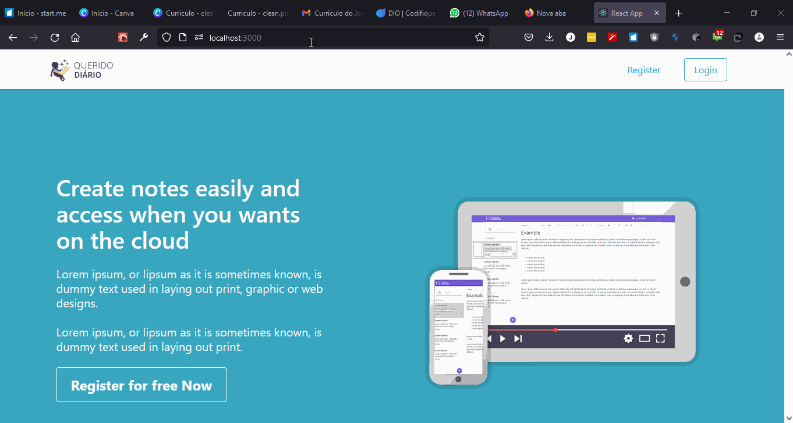

# DiarioAPP-frontEnd
 

## Iniciar este projeto localmente

1. Navege até o diretório raiz do programa `cd /javascript_note`
2. Instale as dependências `npm install`
3. Iniciart o servidor `npm start`

#### Demo (Desktop Version)
HOME                       |  Notes                    | Settings
:-------------------------:|:-------------------------:|:-------------------------:
        |        | 

## Todo - Corrigir rotas

### Documentações para consulta

[React Router - W3 Schools](https://www.w3schools.com/react/react_router.asp)
